_I finally cracked the SSH key to get back into this website lmao_

Exams are over which means I'll have way more time to put into my projects and writing for this post. There are plenty of things I've got planned. Stay tuned!

If I publish this article right, today marks 1 year of my first blog post on this website. 

With an incredible post rate of **1 every 4 months**, I am proud of all the hard work I've clearly put into this blog.

Jokes aside, I've spent a year on Hyprland and I've made a few change to my system I would like to discuss. I'll be going through the same points I went through on my [first system tour](https://johnling.me/blog/My-System-in-Depth) showing what if anything has changed. 

## The Software

Firstly the desktop.

Before:
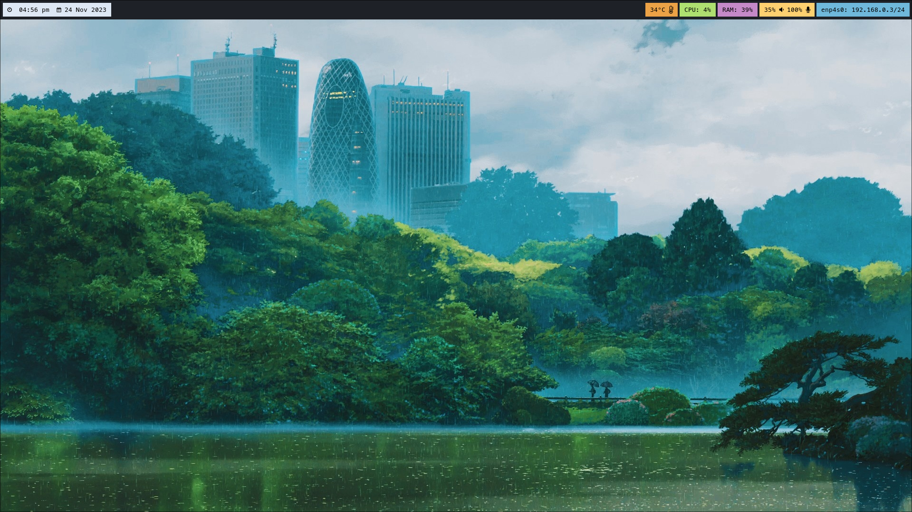

Now: 
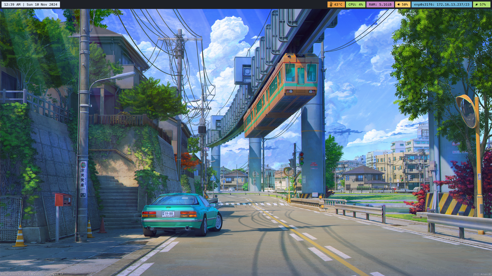


Only a few minor changes to be honest. The menubar is a bit thinner and I added a battery indicator for my laptop. Also the icons are left aligned rather than right. 


While the appearance itself has not changed that much. There are quite a few things 


**OS**: Still Arch Linux<sub>btw</sub>. While I did try [Gentoo](https://johnling.me/blog/Trying-Gentoo) earlier this year, I found it to be too much of a hassle. Perhaps I'll come back to it later however as it stands I'll be sticking with Arch since it does everything I need it to do excuse the occasional hiccup.

**WM**: Still Hyprland. Still great. Nothing much to say honestly. I have stopped using the virtual desktops plugin and switched over to a shell script I wrote.

```bash
#!/bin/bash

. ~/.local/state/currentDesktop.var
currentDesktop=${currentDesktop}

if [ ! $1 -eq 1 ] && [ ! $1 -eq -1 ]
then
        exit 1
fi

if [ $currentDesktop -eq 1 ] && [ $1 -eq -1 ]
then
	exit 1
fi

if [ $currentDesktop -eq 4 ] && [ $1 -eq 1 ]
then
	exit 1
fi

nextDesktop=$((currentDesktop+$1))

# determine which monitor is currently focused
# to figure out which order to switch workspaces
# this means focus is retained on the same monitor when workspaces change

workspaceId=$(hyprctl activeworkspace -j | jq '.id')
if [ $((workspaceId % 2)) -eq 0 ]
then
	if [ $(cat /sys/class/drm/card1-HDMI-A-2/status) == "connected" ]
	then
		hyprctl dispatch workspace $((nextDesktop*2-1))
	fi

	hyprctl dispatch workspace $((nextDesktop*2))
else
	if [ $(cat /sys/class/drm/card1-HDMI-A-2/status) == "connected" ]
	then
		hyprctl dispatch workspace $((nextDesktop*2))
	fi

	hyprctl dispatch workspace $((nextDesktop*2-1))
fi


echo currentDesktop=$((nextDesktop)) > ~/.local/state/currentDesktop.var

exit 0
```

The reason I switched over to this script was because I'd occasionally have problems with the plugin after upgrading versions of Hyprland. It's nothing sophisticated but it basically works regardless of how often I upgrade Hyprland. 


**Terminal**: I still use Alacritty with ZSH and PowerLevel10K but I've switched to using the "Dracula Plus" theme. The terminal uses the font MesloLGS NF which was the font recommended for me to use with P10K (and also the font this website uses). 

Although I use Oh My Zsh, I keep my terminal minimal and I only use the syntax highlighting.

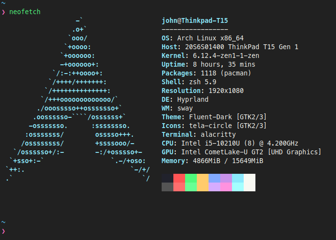

_Obligitory neofetch_


**Browser**: Firefox has done nothing wrong and as such I'll keep using it. I did decrease the font size of my custom Tabliss extension however that's really about it.

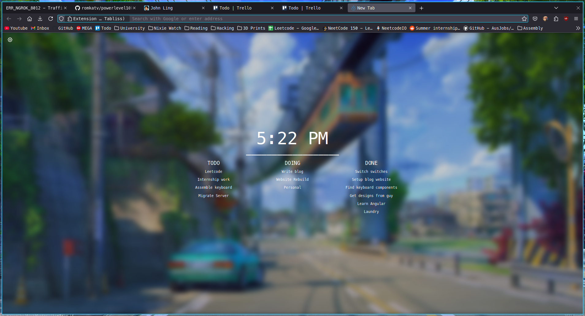

For my passwords, I use Google or Github wherever possible since I have pretty long passwords for both of them. However for the few accounts where I can't use those sites to authenticate, I keep my passwords in a text file hosted on Mega.nz. I considered switching over to Bitwarden however honestly this system works for me and I don't want to add unnecessary overhead to my browser with a password manager.

**Editor**: I still use VSCode because honestly it does everything I need it to do and it's extension system means I can really shape it into an everything editor. For writing these posts, I use it's built-in markdown preview and a spellcheck extension.

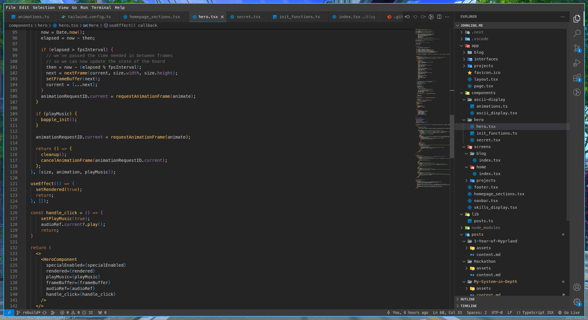

_I will say though. Try moving your sidebar to the right._

Although for quick edits whether in a config file or quickly fixing a program, I've recently picked up Vim. Honestly I'm not quite sure why but I've had some good fun learning to use it. I can't say that editing my Hyprland config file is any faster compared to using Nano but I can say it's a bit less mind numbing with Vim. 


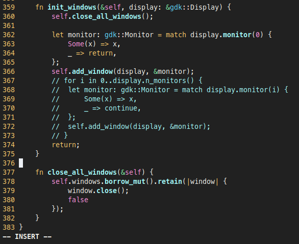


**Audio**: While we're still using Pipewire, I made a few more changes to the [SwayOSD](https://github.com/ErikReider/SwayOSD) program I use for showing audio and brightness changes better. The first change was setting the OSD to only appear on one of my monitors rather than both. This was a really easy tweak in the `application.rs` file under `src/server`.

```rust
fn init_windows(&self, display: &gdk::Display) {
		self.close_all_windows();

		let monitor: gdk::Monitor = match display.monitor(0) {
			Some(x) => x,
			_ => return,
		};
		self.add_window(display, &monitor);
		// for i in 0..display.n_monitors() {
		// 	let monitor: gdk::Monitor = match display.monitor(i) {
		// 		Some(x) => x,
		// 		_ => continue,
		// 	};
		// 	self.add_window(display, &monitor);
		// }
		return;
}
```

Another thing I noticed on my laptop was while the display would only appear on my laptop's screen at first, it would also appear on any monitor I plugged it into. After a quick search through the same `application.rs` file I found some code that handles connection and disconnection of monitors. So I just removed the code to add the display when a monitor is added.

```rust
fn initialize(&self) {
    ...
    ...

    display.connect_monitor_added(clone!(@strong _self => move |d, mon| {
        //_self.add_window(d, mon);
    }));
}
```

**Notetaking**: Obsidian + Git is a match made in heaven. 

## The Hardware

### The PC
My main computer has changed maybe little bit appearance wise but the specs have remained pretty much the same.

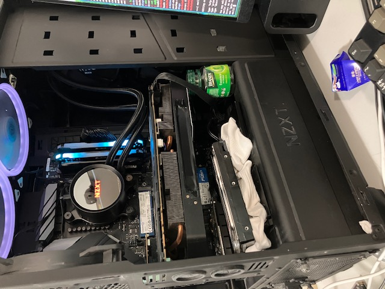

_Chicken essence bottle to prevent GPU sag + sock to dampen hard drive vibrations. HIGH QUALITY PC_

**The Specs**
- Ryzen 5 2600
- GTX 1070
- 32GB 3200MHz RAM (I brought another kit for myself to run local LLMs and VMs better)
- Asus ROG B450-F Gaming Mobo
- NZXT Kraken X53 AIO
- 2x 512GB NVME SSDs
- 1 TB HDD
- Noctis 450 case
- BeQuiet Fans 2x 120mm and 1x 140mm
- 2x 140mm white LED Aigo fans 
- Archer T6E PCI Wifi Card

I used to use a KVM/VFIO setup where I passed one GPU to a Windows or MacOS VM for near native performance. However I prefer a simpler approach so nowaday's you'll find my simply dual booting Windows and Linux. The hard drive is formatted with NTFS so I can send data between Windows and Linux.

This computer has been great. I built it way back in 2020 and it's been going strong ever since. It's gone 4 years already and I'm sure it can do another 4 no problem.


### The Laptop

Still using my first gen Thinkpad T15. While this laptop definitely doesn't have the processing power I would want especially compared the Thinkpads running AMD chips, I've been pretty satisfied with this laptop 

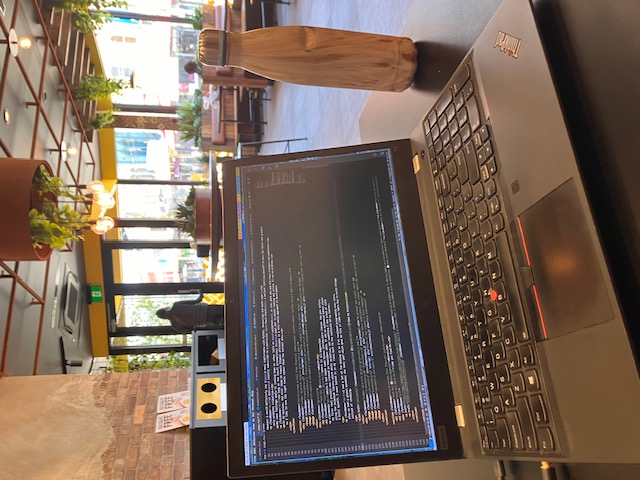

_Instagram worthy photo in the GYG_

It's relatively fast (especially with Linux), has a great keyboard, ethernet (very good when dealing with dogwater accomodation wifi) and is relatively light while also not feeling fragile. I'd give this laptop an 8/10.

### The Server

While I did own an Ubuntu VPS on Digital Ocean for game servers such as Minecraft and Terraria, I used to self host using my old Dell Latitude E7450 since I needed more than the 1GB of RAM offered by the Droplet.

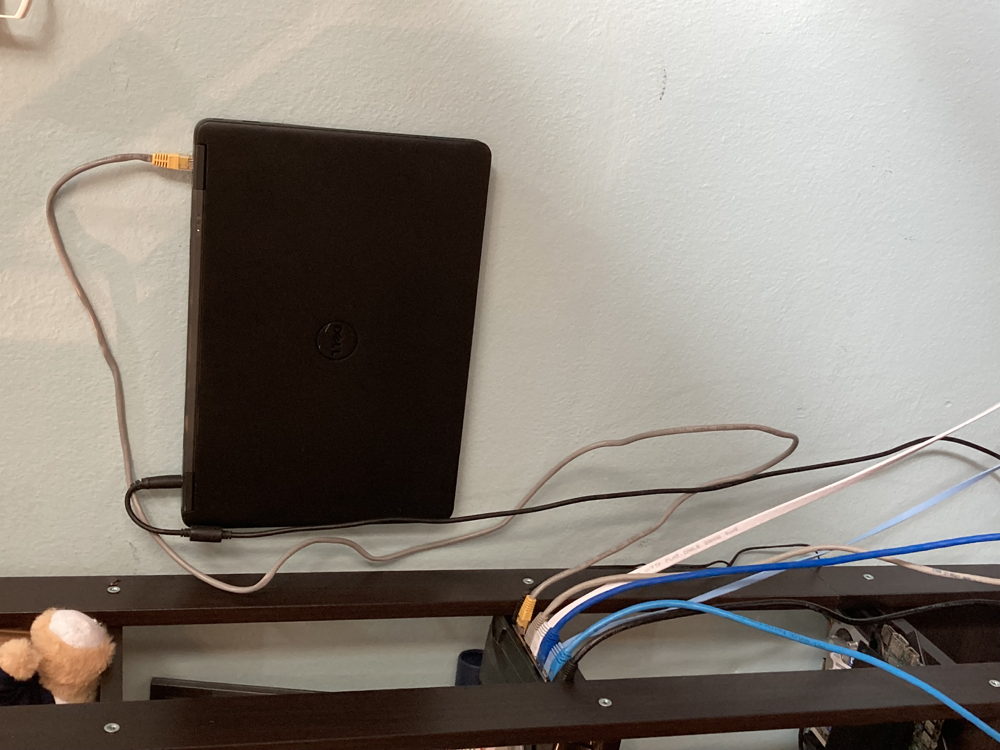

Since then however I've moved everything over to an Oracle Cloud VPS. This server has 24GB RAM and 4 (arm based) CPU cores making it perfect for hosting both my website and my game servers. The best part is that it's FREE. This is relatively common knowledge within the self-hosted space but Oracle Cloud will provide free VPSs to users. I'm writing a quick guide on how to set up this free hosting however many videos and tutorials exist online already. 

After 2 years of service, my absolutely cooked laptop can finally rest.

### The Keyboard

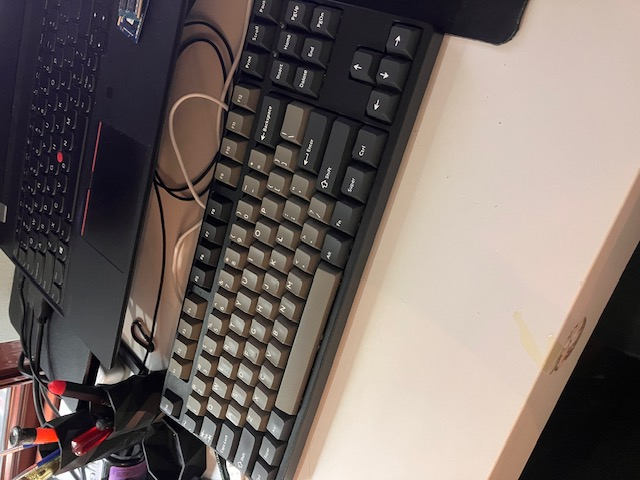

Since I type so much I thought it worth while to get a nice mechanical keyboard back in 2021. I had used a Razer keyboard the past so I was eyeing one up. However I quickly realised tha building my own keyboard would actually cost a bit less. 

After a bit looking online I put together a decent keyboard with Gateron red linear switches. This Christmas however, I bought some tactile AKKO V3 Creamy Blue Pros and the experience while a bit of a bumpy transition has been great. This keyboard is great to type on. 

The keyboard uses Dolch PBTFans keycaps I got as a birthday present. 

In addition to the switches and keycaps I applied a the "tape mode" (literally adding ~ 4 layers of masking tape to the back of the PCB) and holee mod to fix the cheap stabilisers my board came with. I've since then upgraded the stablisers to a pair of better holy panda stabs. I added a bit of lube and they sound better than my regulars even without the mod. 

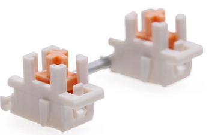


## Conclusion

Yea that's about it. 